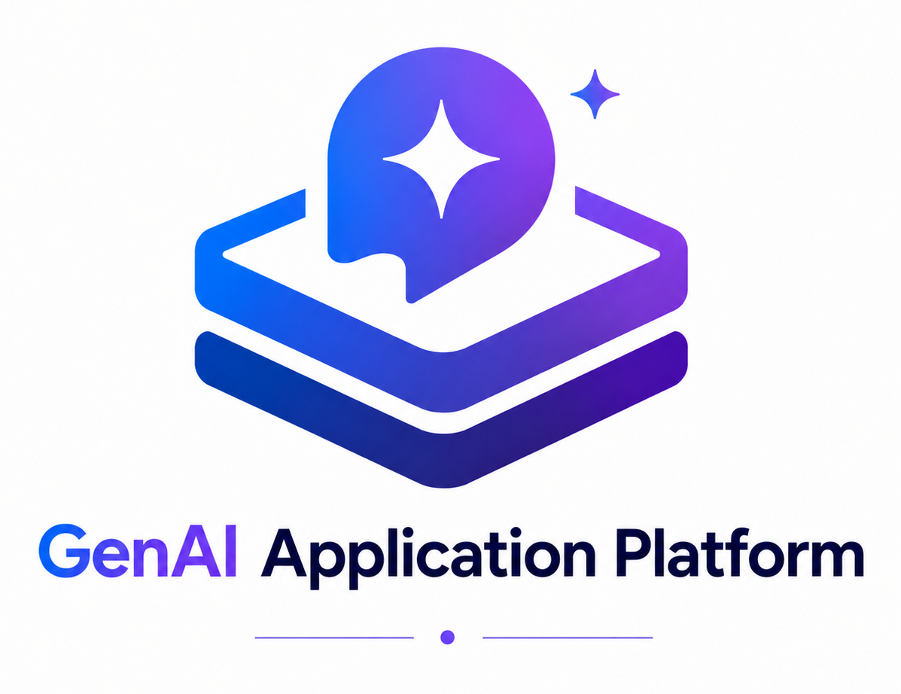

# 🚀 GenAI Application Platform

A comprehensive platform for deploying and managing Generative AI applications on OpenShift, featuring multiple model serving runtimes, vector databases, object storage, API gateways, web interfaces, monitoring, and testing suites.

## 📋 Overview

This project provides a complete, production-ready infrastructure for deploying Generative AI applications on OpenShift. It includes environment preparation, multiple LLM serving backends, vector databases for embeddings, S3-compatible storage, API gateways for unified access, user-friendly GUIs, comprehensive monitoring stacks, and extensive load/performance testing capabilities.

<div align="center">
  
</div>

## ✨ Features

- **Environment Preparation**: Automated setup and cleanup scripts for OpenShift environments
- **GitOps Integration**: ArgoCD configurations for continuous deployment
- **Multiple LLM Backends**: Support for Ollama (CPU), vLLM (CPU/GPU), and NVIDIA NIM (GPU)
- **Vector Databases**: Milvus for high-performance vector similarity search
- **Object Storage**: MinIO S3-compatible storage for models and data
- **API Gateways**: LiteLLM for unified model API access
- **Web GUIs**: AnythingLLM and OpenWebUI for intuitive AI interaction and document management
- **Monitoring Stack**: Grafana dashboards and Prometheus metrics for GPU and model performance
- **Load Testing**: Comprehensive test suite including smoke, stress, spike, and performance tests
- **LLM Performance Testing**: Specialized benchmarks for model inference and throughput
- **Infrastructure Automation**: Scripts for automated deployment and resource management

## 🏗️ Architecture Components

### 🤖 Model Serving Runtimes
- **Ollama**: Lightweight runtime for CPU-based model serving
- **vLLM**: High-performance serving runtime with GPU acceleration
- **NVIDIA NIM**: Optimized microservices for NVIDIA GPU deployments

### 🗄️ Vector Databases
- **Milvus**: Cloud-native vector database for similarity search and embeddings

### 💾 Object Storage
- **MinIO**: S3-compatible object storage for models, documents, and artifacts

### 🌐 API Gateways
- **LiteLLM**: Unified API gateway for accessing multiple LLM providers

### 🖥️ User Interfaces
- **AnythingLLM**: Web-based GUI for document management and AI chat interactions
- **OpenWebUI**: Alternative web interface for AI model interactions

### 📊 Monitoring & Observability
- **Grafana**: Dashboards for monitoring GPU usage, model performance, and system metrics
- **Prometheus**: Metrics collection and alerting system

### 🧪 Testing Infrastructure
- **Load Testing Suite**: Smoke, stress, spike, and performance tests
- **LLM Performance Testing**: Specialized benchmarks for model inference and throughput
- **Benchmarking Tools**: Model performance and throughput testing

### 🚀 GitOps & Automation
- **ArgoCD Configurations**: GitOps manifests for continuous deployment
- **Infrastructure Scripts**: Automated setup and cleanup utilities

## 📋 Prerequisites

- **Kubernetes Cluster**: OpenShift 4.x+ (preferred) or vanilla Kubernetes
- **CLI Tools**: `kubectl` or `oc` installed and configured
- **Storage**: Sufficient persistent storage for models and data
- **Compute Resources**: CPU or GPU nodes depending on deployment type
- **Access**: Cluster admin access for namespace and resource creation

### Optional (for GPU deployments)
- NVIDIA GPUs with appropriate drivers
- NGC API key for NVIDIA NIM models
- NVIDIA Developer Program membership

## 📁 Project Structure

```
genai-application/
├── docs/                   # Documentation and images
│   └── images/            # Documentation images and diagrams
├── env_preparation/        # Environment setup and cleanup scripts
├── gitops/                # GitOps configurations (ArgoCD)
├── models/                # LLM model deployments
│   ├── nvidia_nim/        # NVIDIA NIM GPU models
│   ├── ollama/            # Ollama CPU models
│   └── vllm/              # vLLM CPU/GPU models
├── monitoring_alerting/   # Monitoring stack and alerting rules
├── rag_usecase/           # RAG-specific configurations (example use case)
├── s3_storage/            # S3-compatible storage deployments
│   └── minio_on_openshift/ # MinIO storage deployment
├── tests/                 # Testing suites and performance benchmarks
│   ├── last_und_performance/ # Load and performance tests
│   └── llm_performance/   # LLM-specific performance testing
├── vectordb/              # Vector database deployments
│   └── milvus/            # Milvus vector database
├── web_interfaces/        # Web GUI deployments
│   ├── anythingllm/       # AnythingLLM GUI deployment
│   └── openwebui/         # OpenWebUI interface
├── gpu_deployment.md      # GPU deployment guide
├── infra_preparation_auto.sh  # Infrastructure automation script
├── LICENSE                # Apache 2.0 License
├── README.md              # This file
└── ROADMAP.md             # Project roadmap
```

## 🤝 Contributing

We welcome contributions! Please see our [roadmap](ROADMAP.md) for planned features.

### Development Setup
1. Fork the repository
2. Create a feature branch
3. Make your changes
4. Submit a pull request

### Guidelines
- Follow Kubernetes best practices for manifests
- Include documentation for new components
- Add tests for new functionality
- Update the roadmap for significant changes

## 📄 License

This project is licensed under the Apache License 2.0 - see the [LICENSE](LICENSE) file for details.

## 🙏 Acknowledgments

This project builds upon and includes components from:
- [Milvus on OpenShift](https://github.com/rh-aiservices-bu/llm-on-openshift/tree/main/vector-databases/milvus)
- [AnythingLLM on OpenShift](https://github.com/rh-aiservices-bu/llm-on-openshift/blob/main/llm-clients/anythingllm/)
- [Ollama and Open WebUI](https://gautam75.medium.com/deploy-ollama-and-open-webui-on-openshift-c88610d3b5c7)
- [MinIO on OpenShift](https://ai-on-openshift.io/tools-and-applications/minio/minio/)

## 📞 Support

For issues and questions:
- Check existing [issues](../../issues)
- Create a new issue with detailed information
- Review component-specific READMEs for troubleshooting

---

**Note**: This platform is optimized for OpenShift clusters and provides a foundation for various Generative AI use cases including RAG, chatbots, content generation, and more. Support for other Kubernetes distributions may require modifications.</content>
<parameter name="filePath">c:\Users\bahma\Desktop\projects\13_RAG_LLMs\genai-application\README.md