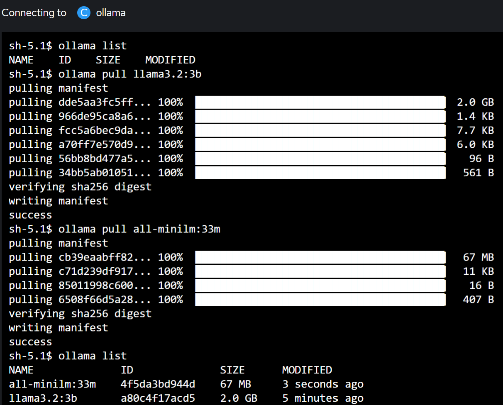

# RAG - AnythingLLM

This repository contains the manifests and resources required to deploy a Generative AI (GenAI) GUI with a Retrieval-Augmented Generation (RAG) architecture. The project is designed to simplify the deployment of a scalable and efficient GenAI solution.

Some of the files and instructions are borrowed from these sources:

- [Milvus on OpenShift](https://github.com/rh-aiservices-bu/llm-on-openshift/tree/main/vector-databases/milvus)
- [AnythingLLM on OpenShift](https://github.com/rh-aiservices-bu/llm-on-openshift/blob/main/llm-clients/anythingllm/Readme.md)
- [Ollama and Open WebUI](https://gautam75.medium.com/deploy-ollama-and-open-webui-on-openshift-c88610d3b5c7)

## Project Structure

The repository is organized as follows:

- **`gui_anythingllm/`**: Contains Kubernetes manifests for deploying the GenAI GUI

- **`milvus/`**: Contains resources for deploying Milvus, a vector database used for efficient similarity search and retrieval

- **`model_ollama/`**: Contains manifests for deploying the Ollama model service


## Prerequisites

Before deploying the solution, ensure you have the following:

- A Kubernetes cluster (e.g., OpenShift, Minikube, or any managed Kubernetes service).
  - <span style="color:orange;"> **Notice**: At the moment, the deployment works only on an OpenShift cluster!
- `kubectl` or `oc` CLI tools installed and configured.
- Sufficient storage and compute resources for the deployment.
- Access to the required container images for the GUI, Milvus, and Ollama model.

## Deployment Instructions

1. **Deploy Milvus**:

    - We will install Milvus based on the insttuction from this link [Milvus on OpenShift](https://github.com/rh-aiservices-bu/llm-on-openshift/tree/main/vector-databases/milvus). Accordingly, I have generated the manifest for a standalone deployment.
   - Navigate to the `milvus/` directory.
   - On the cluster, create a namespace called "**milvus**".
   - We call the release name to be "**vectordb**".
   - This command is used to create the manifest for a standalone deployment:
     ```sh
     helm template -f openshift-values.yaml vectordb -n milvus --set cluster.enabled=false --set etcd.replicaCount=1 --set minio.mode=standalone --set pulsar.enabled=false milvus/milvus > milvus_manifest_standalone.yaml
     ```
   - SecurityContext in deployment **vectordb-minio** and three statefulsets **vectordb-etcd**, **vectordb-pulsarv3-zookeeper**, **vectordb-pulsarv3-bookie**, should be adjusted to openshift requirements:
     ```sh
        yq '(select(.kind == "StatefulSet" and .metadata.name == "vectordb-etcd") | .spec.template.spec.securityContext) = {}' -i milvus_manifest_standalone.yaml
        yq '(select(.kind == "StatefulSet" and .metadata.name == "vectordb-etcd") | .spec.template.spec.containers[0].securityContext) = {"capabilities": {"drop": ["ALL"]}, "runAsNonRoot": true, "allowPrivilegeEscalation": false}' -i milvus_manifest_standalone.yaml
        yq '(select(.kind == "Deployment" and .metadata.name == "vectordb-minio") | .spec.template.spec.containers[0].securityContext) = {"capabilities": {"drop": ["ALL"]}, "runAsNonRoot": true, "allowPrivilegeEscalation": false, "seccompProfile": {"type": "RuntimeDefault"} }' -i milvus_manifest_standalone.yaml
        yq '(select(.kind == "Deployment" and .metadata.name == "vectordb-minio") | .spec.template.spec.securityContext) = {}' -i milvus_manifest_standalone.yaml
        yq '(select(.kind == "StatefulSet" and .metadata.name == "vectordb-pulsarv3-zookeeper") | .spec.template.spec.securityContext) = {}' -i milvus_manifest_standalone.yaml
        yq '(select(.kind == "StatefulSet" and .metadata.name == "vectordb-pulsarv3-zookeeper") | .spec.template.spec.containers[0].securityContext) = {"capabilities": {"drop": ["ALL"]}, "runAsNonRoot": true, "allowPrivilegeEscalation": false}' -i milvus_manifest_standalone.yaml
        yq '(select(.kind == "StatefulSet" and .metadata.name == "vectordb-pulsarv3-bookie") | .spec.template.spec.securityContext) = {}' -i milvus_manifest_standalone.yaml
        yq '(select(.kind == "StatefulSet" and .metadata.name == "vectordb-pulsarv3-bookie") | .spec.template.spec.containers[0].securityContext) = {"capabilities": {"drop": ["ALL"]}, "runAsNonRoot": true, "allowPrivilegeEscalation": false}' -i milvus_manifest_standalone.yaml
     ```
   - Deploy the standalone instance using the manifest:
     ```sh
     kubectl apply -f milvus_manifest_standalone.yaml
     ```
   - It is possible to deploy an user interface (UI) for the Milvus Vector database. It is called attu and can be deployed using the below [manifest](https://github.com/rh-aiservices-bu/llm-on-openshift/blob/main/vector-databases/milvus/attu-deployment.yaml):
     ```sh
     kubectl apply -f attu-deployment.yaml
     ```
   - Make sure all the resources are successfully created and that the pods are running without errors.

2. **Deploy the Ollama Model Service**:
   - We create a namesapce called **Ollama** on the cluster.
   - Navigate to the `model_ollama/` directory.
   - In the manifests called "**all_resources.yaml**", there is a **PVC**, a **Deployment**, and a **Service** to deploy:
     ```sh
     kubectl apply -f all_resources.yaml
     ``` 
   - Make sure all the resources are successfully created and that the pod is running without errors.
   - Now, from OpenShift Console go to the running pod and open the Terminal tab, as shown in the below image:
     
     

   - At the moment, there are no available models listed for ollama. Hence, we pull two models for this example:
       - A chat LLM model:
        ```sh
        ollama pull llama3.2:3b
        ``` 
       - A model for embedding to populate the vector database:
        ```sh
        ollama pull all-minilm:33m
        ``` 
   - The models are loaded to be consumed:
     
     

3. **Deploy the GenAI GUI**:
   - GenAI GUI will be deployed in its namesapce, as well. 
   - When creating a route for this microservice, this name will appear in the URL. Therefore, we choose a meaningfull name as "**rag-genai**".
   - Navigate to the `gui_anythingllm/` directory.
   - Apply the manifests **all_resources.yaml** to deploy a **PVC**, a **Deployment**, a **Service**, and the route to access the GUI:
     ```sh
     kubectl apply -f all_resources.yaml
     ```
   - Make sure all the resources are successfully created.
   - Once the pods are running, the URL can be accessed to begin configuring the interface.
     
     

4. **Configure the GenAI GUI**:
   - First, we choose ollama as the model runtime and set the base URL and correct chat model. Here, the base URL is built as below:
     ```sh
     BASE_URL = http://OLLAMA_SERVICE:SERVICE_PORT
     ```
     

   - Set up an admin user and its password:
  
     

   - Set a workspace name:
     
     

   - From the bottom-left corner of the landing page, navigate to the settings menu.
   - In the customization tab, we set a new **logo**, a suitable **app name** (i.e. *AI Assistant*), some **customized messages** for the welcome page, **icon and links** to the main website or a github page, an appropriate **tab title** and finally a nice **favicon**:
     
     

   - Go to the embedding tab and set the URL and model:
     
     

   - Go to the vector database tab and set the URL:
     
     

5. **Chat with your Documents**:
   - Now you can upload documents and add URLs, which will be then embedded in the workspace, as shown in these images:

    
    
    
   
   - The model uses these embedded information to generate a more accurate response with links to the appropriate sources. 

## Contributing

Contributions are welcome! Please open an issue or submit a pull request for any improvements or bug fixes.

## License

This project is licensed under the terms of the [LICENSE](http://_vscodecontentref_/1) file.

## Acknowledgments

- [Milvus](https://milvus.io/) for vector database capabilities.
- [Ollama](https://ollama.ai/) for model services.
- [AnythingLLM](https://github.com/Mintplex-Labs/anything-llm) for customizable GUI.