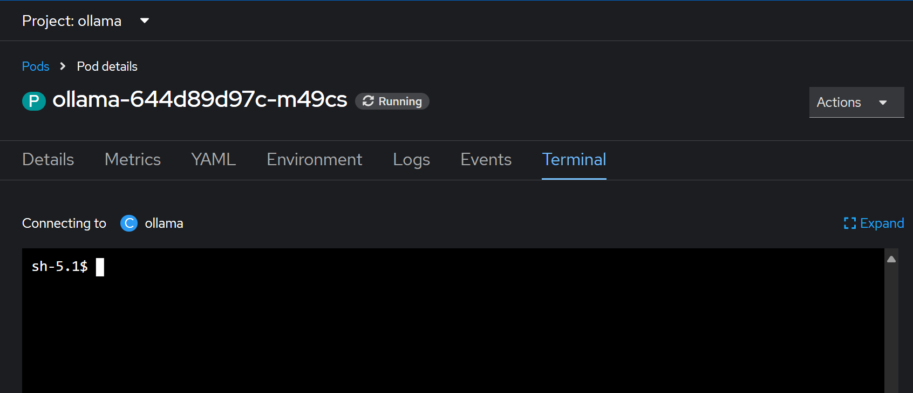
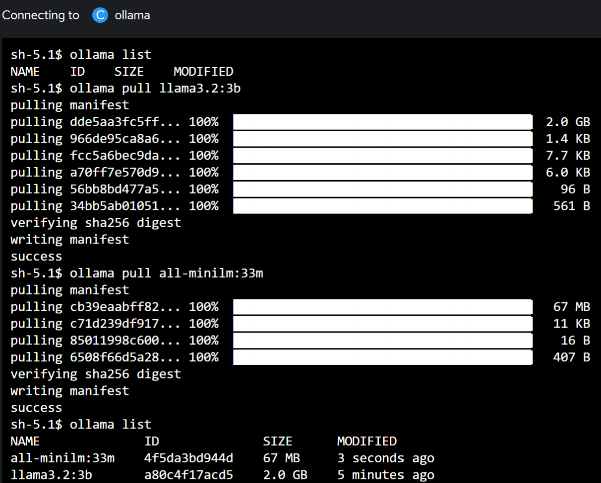

## Deployment Instructions - CPU


1. **Deploy the Ollama Model Service**:
   - We create a namesapce called **Ollama** on the cluster.
   - Navigate to the `model_ollama/` directory.
   - In the manifests called "**all_resources.yaml**", there is a **PVC**, a **Deployment**, and a **Service** to deploy:
     ```sh
     kubectl apply -f all_resources.yaml
     ``` 
   - Make sure all the resources are successfully created and that the pod is running without errors.
   - Now, from OpenShift Console go to the running pod and open the Terminal tab, as shown in the below image:
     
     

   - At the moment, there are no available models listed for ollama. We can pull two models from [Ollama Model Repository](https://ollama.com/search) for this example:
       - A chat LLM model:
        ```sh
        ollama pull MODEL_NAME (e.g. llama3.2:3b)
        ``` 
       - A model for embedding to populate and later on read from the vector database:
        ```sh
        ollama pull MODEL_NAME (e.g. all-minilm:33m)
        ``` 
   - Now the models are loaded and ready to answer requests:
     
     
