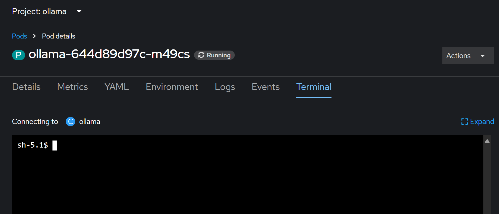

# Model Deployment with Ollama Runtime

## Introduction

Ollama is a lightweight, container-friendly runtime designed for serving large language models (LLMs) with minimal overhead. It enables fast and efficient deployment of pre-trained models on both CPU and GPU environments, making it ideal for edge deployments, local development, or lightweight inference tasks within Kubernetes platforms like OpenShift.

What makes Ollama particularly useful is:

- **Simplicity:** It abstracts away the complexities of model serving by providing a clean, CLI-based interface to run and manage models.

- **Speed:** Ollama optimizes inference latency and startup time, especially when working with quantized models.

- **Flexibility:** Supports a wide range of models for both chat and embedding use cases, which can be pulled and loaded dynamically.

- **Compatibility:** Runs seamlessly in containers, making it a great fit for cloud-native deployments and integration with existing workflows.

This guide walks you through deploying Ollama in a Kubernetes environment on both CPU and GPU backends, enabling you to quickly serve LLMs for various use cases.

## Deployment Instructions - CPU
This section explains how to deploy and serve models using Ollama on CPU within an OpenShift cluster.

**1. Create the Ollama Namespace:**

First, create a dedicated namespace for the Ollama runtime:
```sh
  kubectl create namespace model-ollama
``` 

**2. Deploy the Ollama Model Service:**

Navigate to the deployment manifests:
```sh
  kubectl create namespace model-ollama
``` 

Apply the `all_resources.yaml` manifest, which includes the *PersistentVolumeClaim (PVC)*, *Deployment*, and *Service* for running Ollama:
```sh
  kubectl apply -f all_resources.yaml
``` 

**3. Verify Pod Status**

Ensure all resources are created successfully:
```sh
  kubectl get all -n model-ollama
``` 

Confirm the Ollama pod is in the ``Running`` state without errors.

**4. Access the Pod Terminal**

- Open the OpenShift Console.
- Navigate to the running Ollama pod under the model-ollama namespace.
- Select the Terminal tab to interact with the pod shell:




**5. Pull and Load Models**

By default, no models are loaded. You’ll need to pull models from the [Ollama Model Repository](https://ollama.com/search). For this example, we’ll use:

- **Chat model:** (e.g. llama3.2:3b)
- **Embedding model:** (e.g. all-minilm:33m)

Run the following commands inside the pod terminal:
```sh
  ollama pull llama3.2:3b 
  ollama pull all-minilm:33m 
``` 

Embedding models populates and later on reads from the vector database.

Once pulled, the models are loaded and ready to serve requests.

**6. Confirm Loaded Models**

You can verify which models are available by running:
```sh
  ollama list 
``` 

Example output:

 


## Deployment Instructions - GPU

1. **Deploy the Minio Instance**:
   - We create a namesapce called **minio** on the cluster.
   - Navigate to the `minio_on_openshift/` directory.
   - In the manifests called "**all_resources.yaml**", there is a **PVC**, a **Deployment**, a **Service** and two **routes** to deploy:
     ```sh
     kubectl apply -f all_resources.yaml
     ``` 
   - Make sure all the resources are successfully created and that the pod is running without errors.
   - Default credentials to access Milvus are:
       -  **user** = **'minio'**
       -  **password** = **'minio123'**

2. **Deploy models using vLLM**:
   - I have provided a complete instruction in [model_vllm](./model_vllm/README.md) on how to use vLLM serving runtime in OpenShift AI to deploy models.