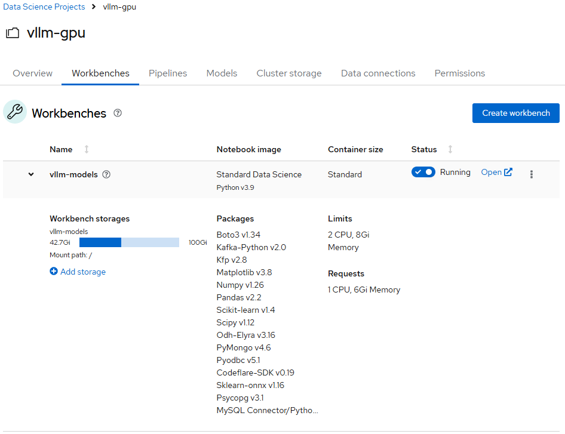
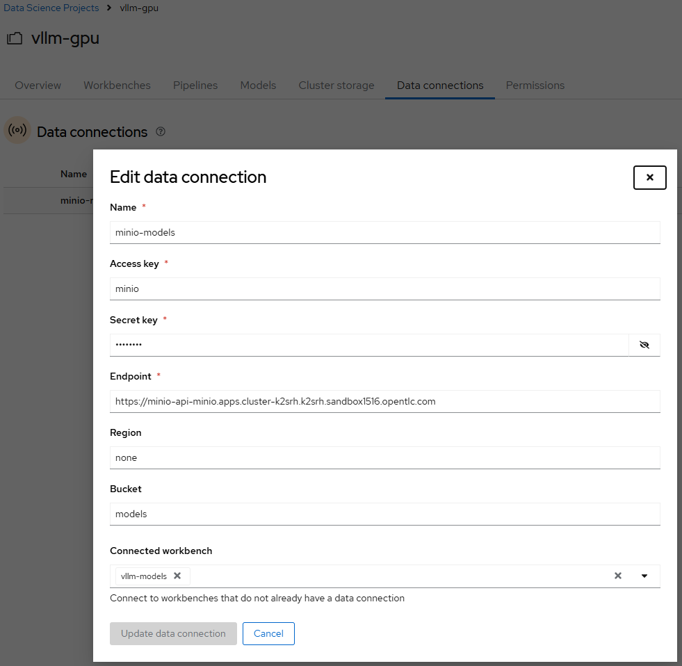
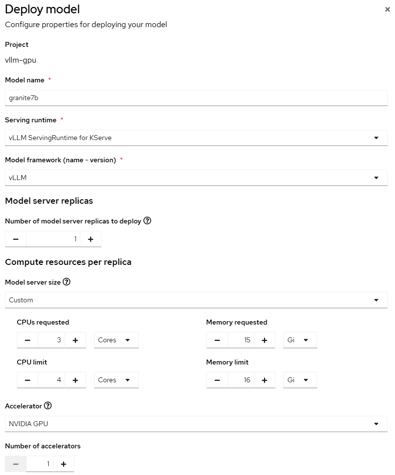
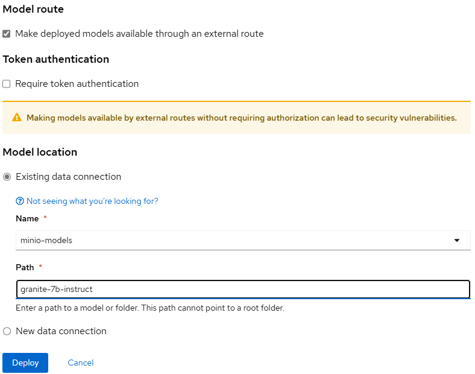
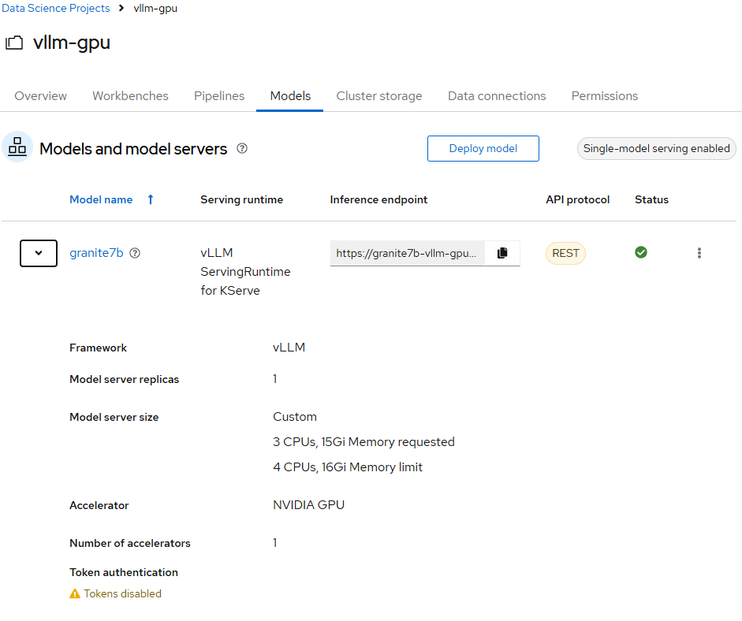
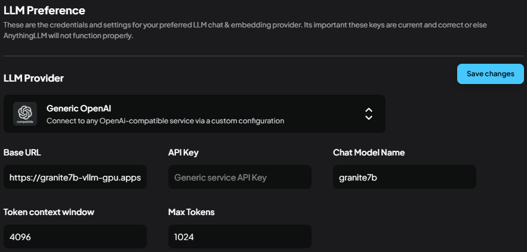

# OpenShift AI and vLLM Model Server with GPU Support

## OpenShift AI Overview

OpenShift AI is a platform designed to simplify the deployment and management of AI/ML workloads on Kubernetes. It provides tools and resources to enable seamless integration of AI models, GPU acceleration, and scalable infrastructure. Key features include:

- **GPU Support**: Leverages GPU resources for high-performance AI/ML workloads.
- **Scalability**: Supports horizontal scaling for large-scale AI applications.
- **Integration**: Works seamlessly with popular AI frameworks and tools.
- **Security**: Ensures secure deployment with OpenShift's built-in security features.

## vLLM Model Server

vLLM is a high-performance model server optimized for serving large language models (LLMs). It is designed to efficiently utilize GPU resources and provide low-latency inference. Key features of vLLM include:

- **Dynamic Batching**: Combines multiple requests into a single batch to maximize GPU utilization.
- **Memory Optimization**: Reduces memory overhead for serving large models.
- **Compatibility**: Supports popular LLMs such as GPT, BERT, and others.

## Deploy model - vLLM ServingRuntime for KServe
To deploy models using the vLLM ServingRuntime provided by OpenShift AI, follow these steps:

1. **Prepare the Model**:
   - Ensure the model is compatible with the vLLM runtime and is stored in a location accessible by the deployment (e.g., an object storage service like MinIO or AWS S3).
   - Here, we use the **Minio** Instance we already deployed to store the model.
   - We need to first download the models from **Huggingface** onto a machine (in this example, we download them on the same cluster) and then push it to the corresponding **Bucket (e.g., 'models')** on S3 storage, as explained below:
   1. On the OpenShiftAI interface, create a project and a workbench using **"Standard Data Science"** image with enough storage attached.
   <div align="center">
     
   </div>

   2. Using **Data Connections**, we can attach the S3 storage, as shown below:
   <div align="center">
     
   </div>

   3. Open the workbench and install required packages to communicate with **Huggingface** and **Minio**:
        ```sh
        pip install -U "huggingface_hub[cli]"
        ```

        ```sh
        curl https://dl.min.io/client/mc/release/linux-amd64/mc --create-dirs -o $HOME/minio-binaries/minio

        chmod +x $HOME/minio-binaries/minio

        export PATH=$PATH:$HOME/minio-binaries/
        ```
    
   4. Login to the **Huggingface** with the token you generated in your account and download a model:
        ```sh
        huggingface-cli login
        ```
        ```sh
        huggingface-cli download MODEL_NAME (e.g. ibm-granite/granite-7b-instruct) --local-dir LOCAL_DIR (e.g. ./granite-7b-instruct)
        ```
    
   5. Set an **Alias** for S3 storage, and copy the local file inside the corresponding bucket:
        ```sh
        minio alias set myminio http://<minio-host>:<port> <access-key> <secret-key>
        ```
        ```sh
        minio cp --recursive /path/to/MODEL_NAME_DIR myminio/mybucket/
        ```
    - Now, the model is available on the S3 storage under the path: *myminio/mybucket/MODEL_NAME_DIR* and ready to be deployed.

2. **Deploy the Model**:
    - Go to the tab **"Models"** on the same project in the OpenShift AI cluster.
    - Enable the model server **"Sinle-Model Serving"** and click on **"Deploy"**.
    - Give the model an appropriate name, **"Model name"**, accodring to the deployed model (e.g. granite7b), select **"vLLM ServingRuntime for KServe"** and model format *"vLLM"*. Choose the model server size according to your model's requirements. Since this serving runtime only works with GPU accelerators, you should choose one at least. 
    <div align="center">
      
    </div>

    - We want our model to be available outside the cluster but do not ask for a token authentication (<span style="color:orange;"> **Notice**: In a production environment, **it is absolutely critical to take all necessary precautions to protect the model endpoint**, as failing to do so can expose your system to serious security risks and vulnerabilities!</span> ).
    <div align="center">
      
    </div>

    - Serving runtime will download the model from S3 storage and the corresponding model directory (**MODEL_NAME_DIR**). After some minutes the model endpoint is ready to accept requests:
    <div align="center">
      
    </div>

3. **Test the Model Endpoint**:
   - There are two ways to test that the model is reachable and responding:
   1. In Terminal, using these commands:
        ```sh
            INFERENCE_ENDPOINT_FROM_OPENSHIFT_AI = #Set the endpoint URL
            curl ${INFERENCE_ENDPOINT_FROM_OPENSHIFT_AI}/v1/chat/completions \
            -H "Content-Type: application/json" \
            -d '{
                "model": "vllm-gpu",
                "messages": [
                {"role": "system", "content": "You are a helpful assistant."},
                {"role": "user", "content": "Hello, who are you?"}
                ]
            }'
        ```
   
   2. Another possibility is explained in the notebook *"test_model_endpoint.ipynb"*

3. **Integrate the Model in RAG Architecture**:
   - In order to integrate this deployed model in the RAG architecture, we should use the LLM provider **"Generic OpenAI"** in *settings/LLM Preference*, and set the provided **Inference Endpoint** + **/v1** in openshiftAI as **"BASE_URL"**. For **"Chat Model Name"**, you should use the same name that was configured in the second section, when deploying the model:
    <div align="center">
      
    </div>

<!--
1. **Update the Deployment Manifest**:
   - Modify the vLLM deployment manifest to include the model path and any required environment variables. For example:
     ```yaml
     env:
     - name: MODEL_PATH
       value: "s3://my-bucket/my-model"
     - name: AWS_ACCESS_KEY_ID
       value: "<your-access-key>"
     - name: AWS_SECRET_ACCESS_KEY
       value: "<your-secret-key>"
     ```

2. **Deploy the Model**:
   - Apply the updated deployment manifest to the OpenShift cluster:
     ```sh
     oc apply -f vllm_deployment.yaml
     ```

3. **Verify the Model Deployment**:
   - Check the logs of the vLLM pod to ensure the model has been loaded successfully:
     ```sh
     oc logs -f <vllm-pod-name>
     ```

4. **Test the Model**:
   - Send a test request to the vLLM server to verify the model is working as expected:
     ```sh
     curl http://<vllm-server-route>/predict -d '{"input": "Test input"}'
     ```

## Deploying vLLM on OpenShift with GPU Support

To deploy the vLLM model server on OpenShift with GPU support, follow these steps:

1. **Prepare the OpenShift Cluster**:
   - Ensure the cluster has GPU nodes available and configured.
   - Install the NVIDIA GPU Operator to manage GPU resources.

2. **Create a Namespace**:
   - Create a dedicated namespace for the vLLM deployment:
     ```sh
     oc create namespace vllm
     ```

3. **Deploy the vLLM Model Server**:
   - Use a deployment manifest that includes GPU resource requests and limits. For example:
     ```yaml
     apiVersion: apps/v1
     kind: Deployment
     metadata:
       name: vllm-server
       namespace: vllm
     spec:
       replicas: 1
       selector:
         matchLabels:
           app: vllm-server
       template:
         metadata:
           labels:
             app: vllm-server
         spec:
           containers:
           - name: vllm
             image: vllm/vllm:latest
             resources:
               limits:
                 nvidia.com/gpu: 1
               requests:
                 nvidia.com/gpu: 1
             ports:
             - containerPort: 8080
     ```

4. **Expose the Service**:
   - Create a service and route to expose the vLLM model server:
     ```sh
     oc expose deployment vllm-server --port=8080 --target-port=8080
     oc expose svc/vllm-server
     ```

5. **Verify the Deployment**:
   - Ensure the pod is running and the GPU is being utilized:
     ```sh
     oc get pods -n vllm
     nvidia-smi
     ```

6. **Test the Model Server**:
   - Send a test request to the vLLM server to verify it is working:
     ```sh
     curl http://<vllm-server-route>/predict -d '{"input": "Hello, world!"}'
     ```

## Conclusion

By deploying the vLLM model server on OpenShift with GPU support, you can achieve high-performance inference for large language models. OpenShift AI simplifies the process, enabling scalable and efficient AI/ML workloads.
-->